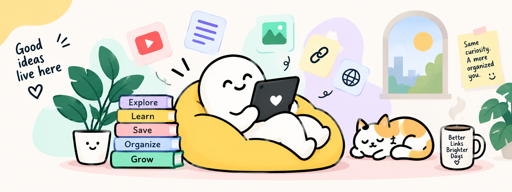
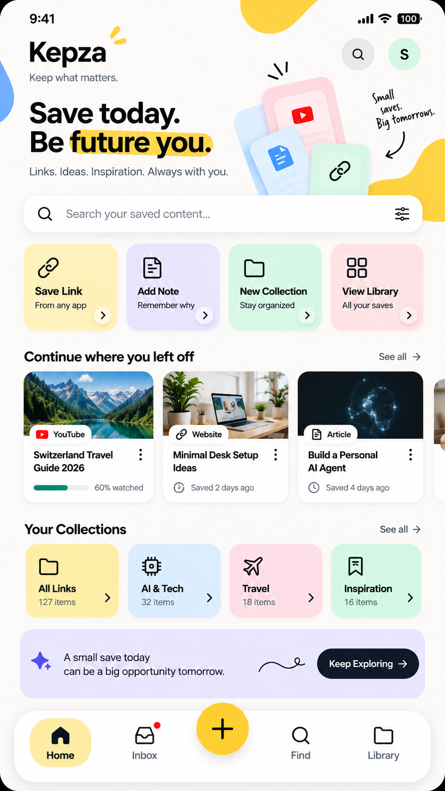
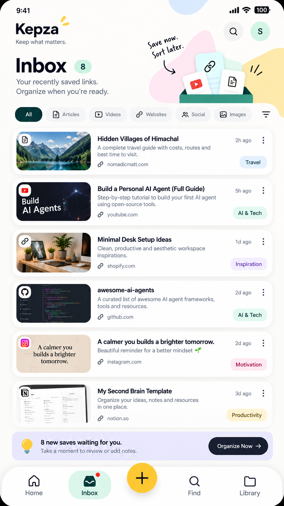
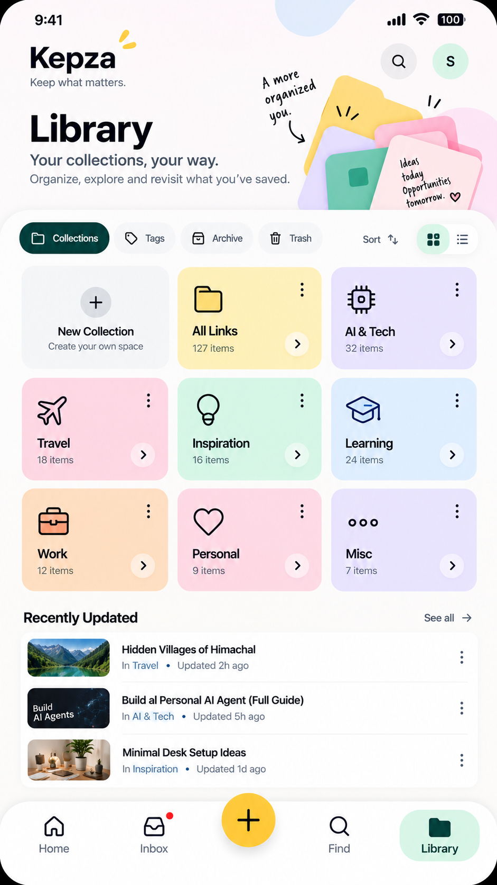
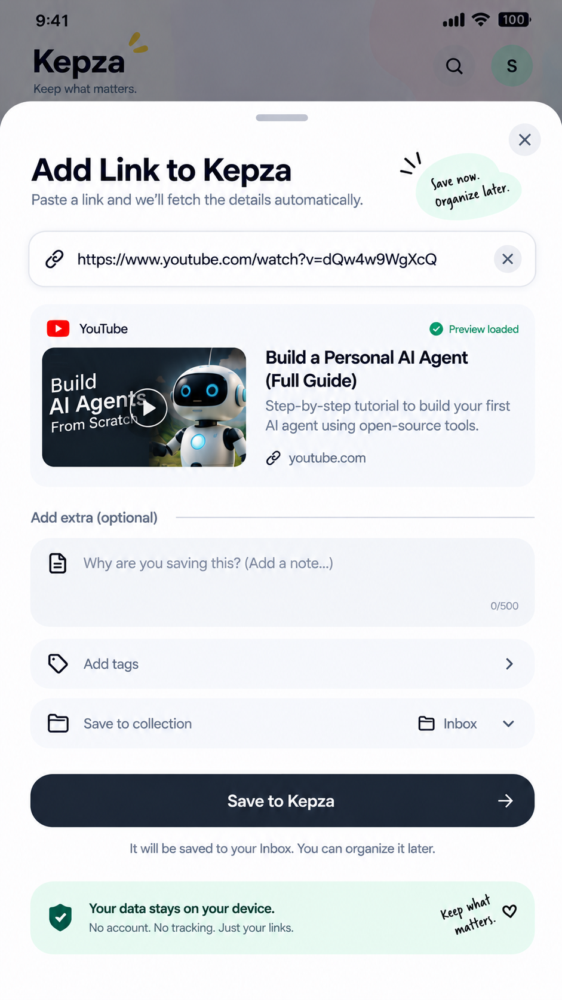
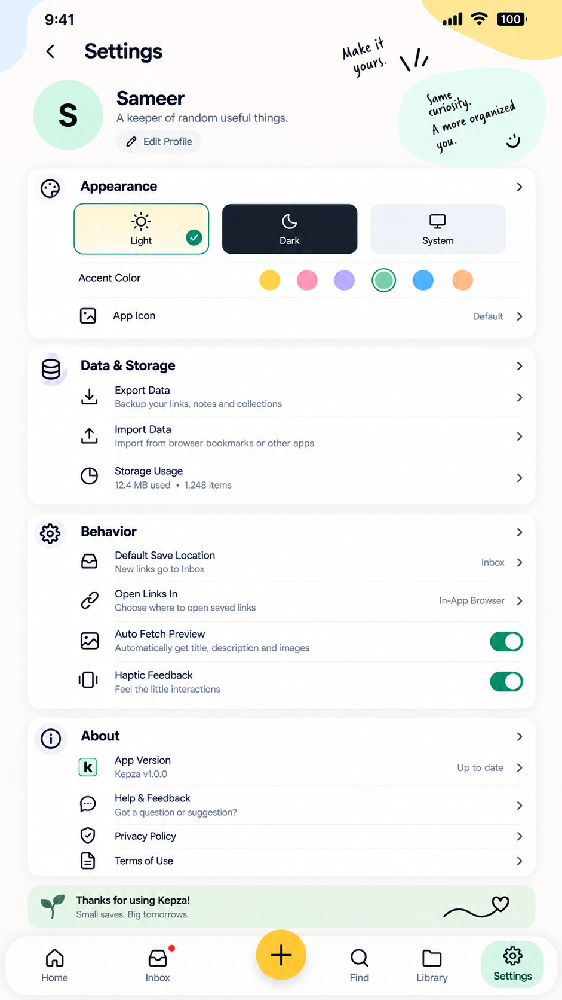
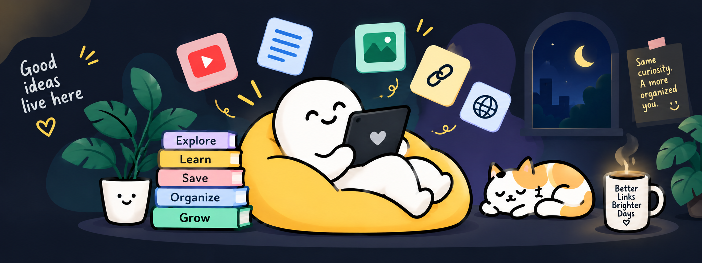

<div align="center">
  
  <h1>Kepza</h1>
  <p><strong>Keep what matters.</strong></p>
  <p>A private, aesthetic bookmarking sanctuary for your favorite links, articles, and inspirations.</p>

  <p>
    <a href="https://github.com/Samyk000/Kepza/releases/latest"></a>
    
    
    
    
  </p>
</div>

<p align="center">
  <picture>
    <source media="(prefers-color-scheme: dark)" srcset="./assets/HeroDark.png">
    
  </picture>
</p>

---

## 🌟 What is Kepza?

**Kepza** is your personal digital pocket. We built it because modern bookmarking tools are often cluttered, slow, or track everything you read. 

Kepza takes the opposite approach: **cozy aesthetics, blazing speed, and 100% privacy**. Every link, note, and collection lives securely on your device.

---

## ✨ Features You'll Love

- ⚡ **Instant Link Saving**: Paste any link, and Kepza automatically pulls rich previews, titles, descriptions, and thumbnails.
- 📥 **Inbox & Organize Later**: Save now with one tap, sort when you're ready. No cognitive overload while browsing.
- 📂 **Custom Collections**: Group your bookmarks into beautiful color-coded spaces like *Tech*, *Travel*, *Recipes*, or *Inspiration*.
- 🔍 **Instant Search**: Find anything in milliseconds with in-place search across titles, URLs, and personal notes.
- 🏷️ **Tags & Formats**: Effortlessly filter by content type (Articles, Videos, Websites, Social) or custom tags.
- 🎨 **Theme & Accent Customization**: Beautiful Light and Dark modes with curated pastel accent colors (Sunny Yellow, Mint, Lavender, Peach, Rose, Sky Blue).
- 📳 **Tactile Haptics**: Delightful micro-vibrations for every action that make the app feel alive.
- 🔒 **100% Privacy & Local-First**: Built on high-performance local SQLite storage. No account creation required, no trackers, and zero telemetry.

---

## 📱 Visual Tour

<table align="center" width="100%">
  <tr>
    <td align="center" width="33%">
      <br />
      <b>Home Vault</b><br />
      <sub>All your bookmarks in one view with list and grid layouts.</sub>
    </td>
    <td align="center" width="33%">
      <br />
      <b>Quick Inbox</b><br />
      <sub>Drop links on the go and organize them whenever you're free.</sub>
    </td>
    <td align="center" width="33%">
      <br />
      <b>Library Spaces</b><br />
      <sub>Organize by collections, view recent updates, and tag links.</sub>
    </td>
  </tr>
  <tr>
    <td align="center" width="33%">
      <br />
      <b>Smart Link Saver</b><br />
      <sub>Auto-fetching previews with custom notes and collection pickers.</sub>
    </td>
    <td align="center" width="33%">
      <br />
      <b>Themes & Customization</b><br />
      <sub>Choose your favorite accent colors and light/dark theme.</sub>
    </td>
    <td align="center" width="33%">
      <br />
      <b>Cozy Dark Mode</b><br />
      <sub>Night-friendly ambiance with seamless dark visuals.</sub>
    </td>
  </tr>
</table>

---

## 📥 Download the App

Ready to use Kepza on your Android phone?

👉 **[Download Latest Release (Kepza.apk)](https://github.com/Samyk000/Kepza/releases/latest)**

*Works on Android 8.0 (Oreo) and above. Simply download the `.apk` and tap install.*

---

## 💻 Running from Source

Want to run Kepza locally or test on your computer?

```bash
# 1. Clone the repository
git clone https://github.com/Samyk000/Kepza.git
cd Kepza

# 2. Install dependencies
npm install

# 3. Start the dev server
npx expo start
```

Press `w` in your terminal to open the web version, or scan the QR code with the **Expo Go** app on your phone.

---

## 🔒 Privacy & Your Data

Your bookmarks belong to you. Kepza stores your data inside an encrypted local database on your device. It never connects to tracking servers, never sells data, and works completely offline.

---

<div align="center">
  <p><i>Small saves. Big tomorrows.</i></p>
  <p>Built with ❤️ for curious minds.</p>
</div>
